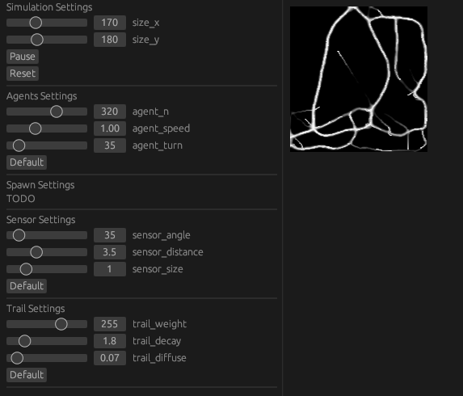

# Agent simulation

Heavily based on this [video](https://www.youtube.com/watch?v=X-iSQQgOd1A), after seeing it i was trying to reproduce the second part, learning rust GUI and GPU along the way 🙌

The inner logic of agent and simulation can be listed as:
1. Sense
2. Rotate
3. Move
4. Deposit
5. Diffuse
6. Decay

More details can be found [here](https://cargocollective.com/sagejenson/physarum) and on academic [paper](https://uwe-repository.worktribe.com/output/980579)
